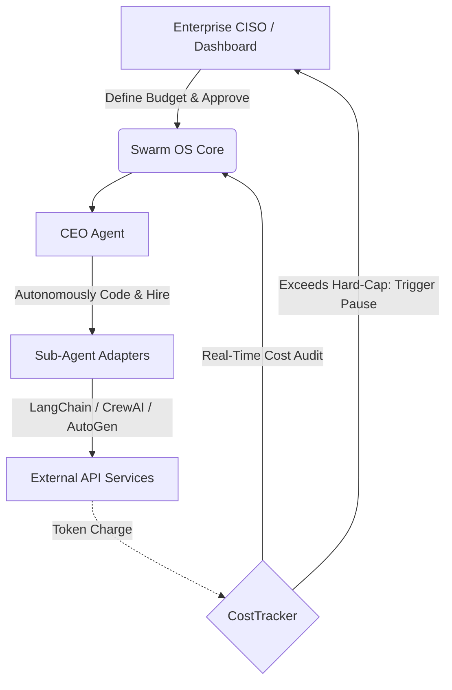

# Copyright (c) 2026 SANGHA1986. All rights reserved. Licensed under BUSL-1.1.

# HireAI: The Budget-Native Swarm OS
### Business Proposal for Enterprise CXO & CISO
### 대기업 임원진 및 CISO를 위한 비즈니스 제안서

---

## 🇺🇸 English Version

### 1. Executive Summary
Traditional AI orchestration models fail to align with the financial realities of modern enterprises. The unconstrained deployment of large language models (LLMs) leads to unpredictable token costs, API rate limit failures, and operational chaos. 

**HireAI** is not a simple cost-reduction tool; it is a **"Budget-Native Swarm OS"**. Operating as a sovereign AI corporate engine, HireAI allows a top-level CEO agent to autonomously program, spawn, and hire (instantiate) customized sub-agents tailored for specific operational tasks, while enforcing real-time, ironclad budget guards. By standardizing existing frameworks (like LangChain, CrewAI, AutoGen) as subordinate adapters, HireAI ensures that your enterprise preserves its cash flow while automating operations.

---

### 2. Core Value Proposition

#### A. AI Autonomous Hiring & Productivity Revolution
Instead of maintaining static, expensive developer pipelines for every business requirement:
* **Self-Programming Sub-Agents**: The top-level CEO agent translates strategic business objectives into execution scripts. It dynamically codes new micro-functional sub-agents on the fly and hires them directly into memory.
* **Just-In-Time Workforce**: Agents are spawned on-demand and immediately dissolved when their tasks are completed, eliminating runtime bloat and reducing server overhead.

#### B. Ironclad Budget & Token Guardrails (First-Class CostTracker)
Uncontrolled LLM cascades are a financial risk. HireAI implements a zero-trust financial layer:
* **Dynamic Pause (Real-Time Freeze)**: When any worker or sub-agent approaches the predefined budget threshold (`hard_cap`), HireAI instantly pauses the execution context. Every outbound API call is safely frozen.
* **Resume Engine (Human-In-The-Loop Approval)**: A CISO or authorized financial administrator can review usage on a dedicated dashboard and inject additional funds. The OS then unfreezes and resumes execution precisely from the point it was paused, ensuring zero lost progress or duplicate token billing.

#### C. Enterprise Compliance & Safe Delivery
Designed from the ground up for strict corporate environments:
* **Plug-and-Play Integration**: HireAI sits on top of your current stack, converting Langchain, CrewAI, or AutoGen instances into low-level adapters without rewriting your legacy codebase.
* **Air-Gapped & Offline Security**: Packaged as a clean python wheel (`.whl`), it is easily deployable to offline private clouds and air-gapped corporate servers, guaranteeing that no internal data leaks to unauthorized public networks.
* **BUSL 1.1 Commercial Protections**: Protects intellectual property and revenue streams. Under the Business Source License 1.1, the engine is free for personal use and small business operations (under 300M KRW annual revenue), but requires a formal commercial contract for enterprise integration.

---

### 3. Architecture Overview

---

## 🇰🇷 한국어 버전 (Korean Version)

### 1. 총괄 요약 (Executive Summary)
기존의 AI 오케스트레이션 프레임워크들은 기업 재무의 현실과 일치하지 않는 비효율적인 구조를 갖고 있습니다. AI 에이전트의 무작위적인 LLM 호출은 예측이 불가능한 토큰 비용 청구, API 요청 한도 초과 오류(429 Rate Limit), 그리고 비즈니스 운영 통제의 불능 상태를 유발합니다.

**HireAI**는 단순한 AI 비용 절감 툴이 아닙니다. **"돈을 먼저 지키는 AI 회사 엔진(Budget-Native Swarm OS)"**입니다. HireAI는 최고 책임자(CEO Agent)가 비즈니스 지시를 내리면 백엔드에서 필요한 맞춤형 서브 AI를 스스로 프로그래밍하여 메모리에 실시간으로 '고용(Hire)'하고, 고용된 일꾼들의 토큰 사용 비용을 실시간 감시 및 즉각 동결하는 독자적인 기업 운영 체제입니다. 기존의 LangChain, CrewAI, AutoGen 같은 개발 도구들은 이 OS 밑에서 지시에 따르는 '하청 어댑터'로서 기능하게 됩니다.

---

### 2. 핵심 비즈니스 가치

#### A. AI 자율 고용 및 생산성 혁명
모든 비즈니스 요구사항을 처리하기 위해 매번 개발 인력을 투입하고 모델을 수동 패치할 필요가 없습니다.
* **자가 프로그래밍 및 고용**: CEO 에이전트가 고수준의 비즈니스 목적을 파악한 후, 그에 맞는 마이크로 기능의 서브 에이전트 코드를 메모리상에 스스로 작성 및 배포(Hire)하여 작업을 수행합니다.
* **온디맨드 인력 최적화**: 작업을 마친 임시 에이전트는 즉각 해고(Dissolve)되어 메모리에서 소멸되므로 서버 리소스 및 불필요한 고정 유지 비용을 최소화합니다.

#### B. 철저한 비용 감시 가드레일 (CostTracker)
재정적 통제력이 없는 AI의 연속적인 연쇄 호출은 심각한 재무 리스크를 유발합니다. HireAI는 제로 트러스트(Zero-Trust) 예산 구조를 실현합니다.
* **실시간 동적 동결 (Dynamic Pause)**: 설정된 임계값(Hard-Cap)에 도달하는 즉시 모든 API 통신을 전면적이고 안전하게 프리징(Freeze)합니다.
* **대시보드 승인 및 재개 엔진 (Resume)**: CISO 또는 권한을 가진 관리자가 대시보드에서 추가 비용을 승인하면, 작업을 처음부터 다시 하는 것이 아니라 정확히 멈춘 실행 흐름 시점부터 중복 결제 없이 안전하게 연계하여 재개(Resume)합니다.

#### C. 엔터프라이즈 컴플라이언스 및 안전한 폐쇄망 납품
대기업의 보안 및 인프라 요구 조건을 가장 안전한 형태로 만족합니다.
* **플러그앤플레이(Plug-and-Play) 호환성**: 기존의 기업 인프라나 레거시 코드를 갈아엎지 않고, 기존 시스템 상단에 접착제처럼 부착하여 비용 모니터링 레이어를 구축할 수 있습니다.
* **오프라인 폐쇄망 배포**: 완제품 배포 형태인 독립 파이썬 패키지(`.whl`)로 제공되어 외부 인터넷 통신이 단절된 사내 온프레미스(On-Premise) 환경과 공공·금융권 폐쇄망 서버에 안전하게 구축이 가능합니다.
* **BUSL 1.1 라이선스 보호 장치**: 소형 비즈니스(연 매출 3억 원 이하) 및 연구 목적에는 무료로 소스코드를 개방하되, 연 매출 3억 원 이상의 대기업 환경 및 상업용 시스템 결합 시에는 유료 상업 라이선스를 맺도록 하여 상용 기술 보호망을 완비했습니다.

---

# Copyright (c) 2026 SANGHA1986. All rights reserved. Licensed under BUSL-1.1.
